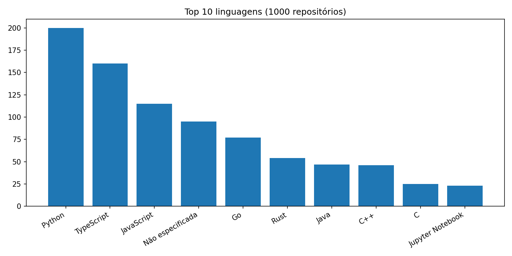
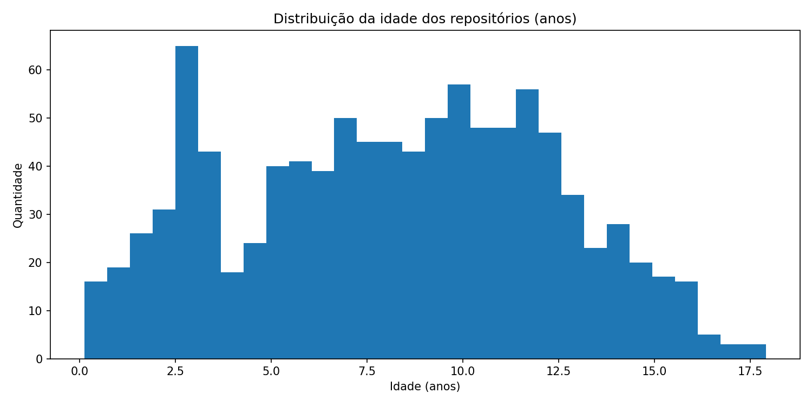
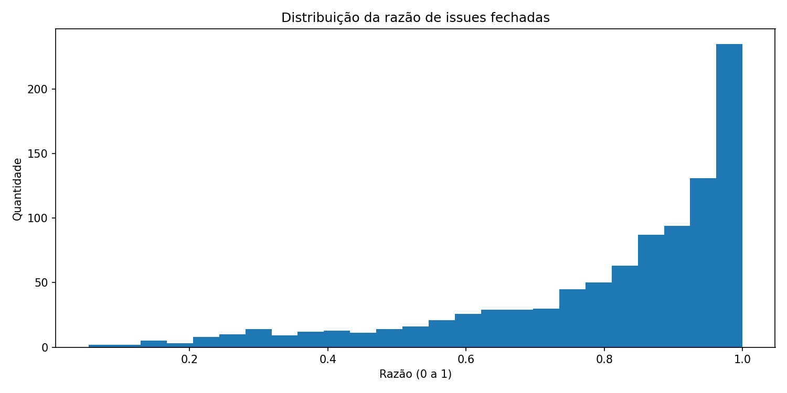
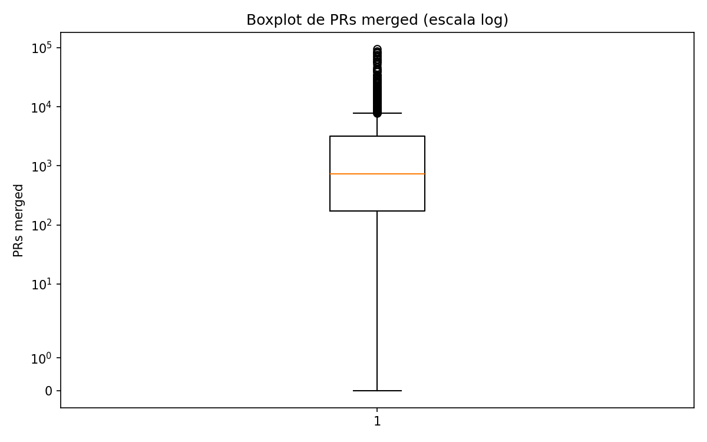
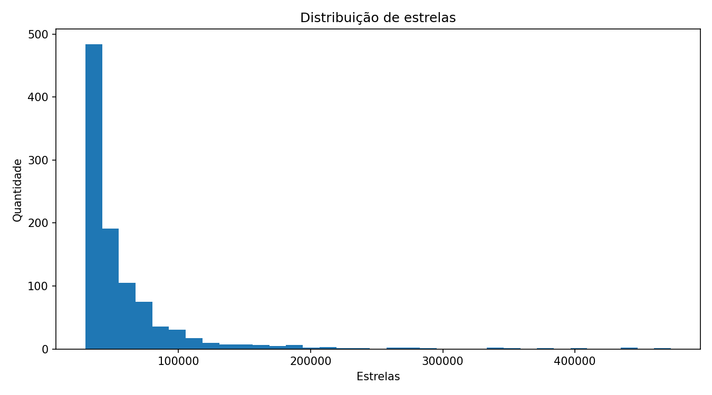
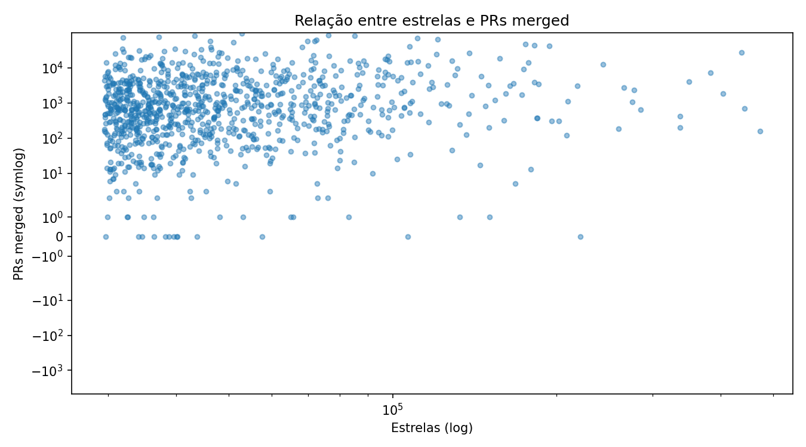

# Características de Repositórios Populares no GitHub (Sprint 3)

## Autores

- Kaio Henrique Oliveira da Silveira Barbosa

## Introdução

Este relatório final consolida os resultados de um estudo empírico sobre repositórios populares no GitHub, com base em uma amostra de 1000 projetos coletados via API GraphQL. A proposta do trabalho é investigar características de maturidade, colaboração, manutenção e tecnologia por meio de métricas observáveis e reproduzíveis.

O estudo foi conduzido em três sprints: (1) validação da coleta e das queries, (2) escalabilidade com paginação e persistência dos dados em CSV, e (3) análise estatística com visualizações e tomada de decisão sobre hipóteses. A análise combina medidas de tendência central, distribuição e concentração, permitindo interpretar não apenas valores médios, mas também assimetria e variabilidade entre os projetos.

## Questões de pesquisa e hipóteses

- **RQ01**: Sistemas populares são maduros/antigos?
  - Hipótese: sistemas populares tendem a ser mais antigos.
- **RQ02**: Sistemas populares recebem muita contribuição externa?
  - Hipótese: sistemas populares apresentam alto volume de PRs aceitas.
- **RQ03**: Sistemas populares lançam releases com frequência?
  - Hipótese: sistemas populares lançam releases regularmente.
- **RQ04**: Sistemas populares são atualizados com frequência?
  - Hipótese: sistemas populares são atualizados recentemente.
- **RQ05**: Sistemas populares são escritos nas linguagens mais populares?
  - Hipótese: linguagens predominantes incluem JavaScript, Python, Java e TypeScript.
- **RQ06**: Sistemas populares possuem alto percentual de issues fechadas?
  - Hipótese: percentual de fechamento de issues é alto.

## Objetivo

Responder quantitativamente às 6 questões de pesquisa (RQs) com base em dados reais coletados nas sprints anteriores, utilizando análise estatística descritiva e visualizações para sustentar decisões.

De forma específica, o objetivo é:

- medir maturidade dos projetos (idade);
- medir intensidade de contribuição externa (PRs merged);
- medir regularidade de releases;
- medir recência de manutenção (dias desde atualização);
- identificar concentração tecnológica (linguagens predominantes);
- avaliar saúde operacional (razão de issues fechadas).

Além de responder "sim/não" para cada hipótese, o relatório busca explicar o comportamento das distribuições e os possíveis motivos para concentração de valores extremos.

## Metodologia

1. Leitura do arquivo CSV da Sprint 2 (`docs/Sprint2/repositorios.csv`).
2. Limpeza e normalização dos dados numéricos.
3. Cálculo de métricas centrais (média e mediana) por RQ.
4. Geração de gráficos de distribuição e frequência.
5. Interpretação dos resultados e decisão sobre as hipóteses.

### Regras de decisão adotadas

- RQ01: hipótese confirmada se mediana da idade >= 5 anos.
- RQ02: hipótese confirmada se mediana de PRs merged >= 100.
- RQ03: hipótese confirmada se mediana de releases >= 10.
- RQ04: hipótese confirmada se mediana de dias desde atualização <= 30.
- RQ05: hipótese confirmada se ao menos 3 linguagens esperadas (JS/Python/Java/TS) aparecem no top 10.
- RQ06: hipótese confirmada se mediana da razão de issues fechadas >= 80%.

## Resultados

### Tabela de respostas das RQs

| RQ | Métrica analisada | Resultado numérico | Resposta |
|---|---|---|---|
| RQ01 | Mediana da idade dos repositórios | 8.39 anos | Sim |
| RQ02 | Mediana de PRs merged | 739 | Sim |
| RQ03 | Mediana de releases | 40 | Sim |
| RQ04 | Mediana de dias desde atualização | 0 dias | Sim |
| RQ05 | Top linguagens | Python, TypeScript, JavaScript, Não especificada, Go | Sim |
| RQ06 | Mediana da razão de issues fechadas | 87.78% | Sim |

### Tabela de linguagens (Top 10)

| Posição | Linguagem | Quantidade | Percentual |
|---|---|---:|---:|
| 1 | Python | 200 | 20.00% |
| 2 | TypeScript | 160 | 16.00% |
| 3 | JavaScript | 115 | 11.50% |
| 4 | Não especificada | 95 | 9.50% |
| 5 | Go | 77 | 7.70% |
| 6 | Rust | 54 | 5.40% |
| 7 | Java | 47 | 4.70% |
| 8 | C++ | 46 | 4.60% |
| 9 | C | 25 | 2.50% |
| 10 | Jupyter Notebook | 23 | 2.30% |

### Métricas gerais

- Total de repositórios analisados: **1000**
- Faixa de estrelas: **29,574** a **472,576**
- Média de estrelas: **58017**
- Média de idade: **8.19 anos**
- Média de PRs merged: **3956**
- Média de releases: **120.67**
- Média de dias desde atualização: **0.00 dias**
- Média da razão de issues fechadas: **80.57%**

### Métricas avançadas (distribuição)

| Métrica | Q1 (25%) | Mediana (50%) | Q3 (75%) | P90 | P95 |
|---|---:|---:|---:|---:|---:|
| Idade (anos) | 5.01 | 8.39 | 11.42 | 13.57 | 14.75 |
| PRs merged | 173.50 | 739.00 | 3207.25 | 9586.90 | 18266.40 |
| Releases | 0.00 | 40.50 | 145.00 | 334.20 | 558.05 |
| Razão de issues fechadas | 71.75% | 87.78% | 96.07% | 98.98% | 99.66% |

### Métricas de atividade recente

- Repositórios atualizados no mesmo dia da coleta: **997 / 1000 (99.7%)**
- Repositórios atualizados em até 7 dias: **1000 / 1000 (100%)**
- Repositórios atualizados em até 30 dias: **1000 / 1000 (100%)**
- Participação das 5 linguagens mais frequentes: **64.7%** do total

### Gráficos

#### Top Linguagens

Este gráfico de barras mostra a frequência das linguagens primárias nos 1000 repositórios analisados. A leitura indica forte concentração em Python, TypeScript e JavaScript, sugerindo predominância de ecossistemas amplamente adotados em projetos de alta visibilidade.

#### Distribuicao Idade

O histograma de idade mostra como os projetos se distribuem por faixa etária. A mediana de 8.39 anos e o quartil superior acima de 11 anos reforçam que repositórios populares tendem a ser maduros, com histórico de evolução mais longo.

#### Distribuicao Issues Fechadas

Este histograma evidencia a distribuição da razão de fechamento de issues. A concentração em valores altos (com mediana de 87.78%) indica que, para a maior parte dos projetos analisados, existe rotina consistente de triagem e resolução de problemas.

#### Boxplot Prs

O boxplot resume dispersão e assimetria dos PRs merged. A distância entre mediana e limites superiores, somada à presença de valores extremos, mostra que poucos projetos concentram volume muito alto de contribuições, enquanto a maioria mantém níveis moderados.

#### Distribuição de Estrelas

O histograma de estrelas mostra a heterogeneidade de popularidade dentro da amostra. Embora todos os projetos sejam populares, a distribuição evidencia diferentes "níveis" de popularidade, com cauda longa para repositórios excepcionalmente estrelados.

#### Relação entre Estrelas e PRs

O gráfico de dispersão (com escalas log/symlog) permite analisar associação entre popularidade e contribuição externa. Observa-se tendência positiva geral, mas com ampla variabilidade: projetos com estrelas semelhantes podem ter volumes bem diferentes de PRs merged.

## Discussões (insights)

- A maturidade observada (mediana de 8.39 anos) sugere que popularidade, em geral, está associada a trajetória longa de evolução e estabilização.
- A colaboração externa é alta, mas desigual: a mediana de 739 PRs merged contrasta com percentis superiores muito elevados, indicando concentração de contribuição em subconjunto de projetos.
- Releases apresentam comportamento heterogêneo: apesar de muitos projetos com alta frequência, parte relevante possui poucas releases, mostrando diferentes estratégias de versionamento.
- A recência de atualização é extremamente alta (99.7% no mesmo dia e 100% em até 7 dias), reforçando um cenário de manutenção ativa na amostra.
- A composição de linguagens confirma tendências atuais da indústria, com predominância de stacks modernas e de alta adoção comunitária.
- A razão elevada de issues fechadas (mediana de 87.78%) indica boa capacidade operacional de resposta, triagem e resolução em grande parte dos repositórios.
- Em conjunto, os resultados mostram que popularidade não depende de um único fator; ela emerge da combinação entre maturidade, atividade contínua, engajamento externo e governança técnica.

## Conclusão e tomadas de decisão (hipóteses)

Com base nas regras de decisão definidas na metodologia, todas as hipóteses foram confirmadas. Isso indica que, na amostra analisada, repositórios populares tendem a combinar maturidade histórica, manutenção recente, capacidade de colaboração externa e boa saúde operacional.

Resumo das decisões:

- **RQ01**: hipótese confirmada, pois a mediana de idade foi 8.39 anos (acima do limiar de 5 anos).
- **RQ02**: hipótese confirmada, pois a mediana de PRs merged foi 739 (acima do limiar de 100).
- **RQ03**: hipótese confirmada, pois a mediana de releases foi 40 (acima do limiar de 10).
- **RQ04**: hipótese confirmada, pois a mediana de dias desde atualização foi 0 (abaixo do limiar de 30 dias).
- **RQ05**: hipótese confirmada, pois as linguagens esperadas aparecem entre as mais frequentes.
- **RQ06**: hipótese confirmada, pois a mediana da razão de issues fechadas foi 87.78% (acima do limiar de 80%).

Como implicação prática, os resultados sugerem que projetos populares bem-sucedidos tendem a manter ciclo ativo de atualização, governança de issues e abertura para colaboração. Como limitação, a análise representa uma fotografia temporal da plataforma e pode variar conforme janela de coleta, critérios de busca e dinâmica do ecossistema.

